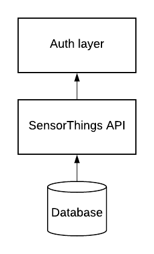

#Bringing authentication and authorization to the SensorThings API

 

The OGC standardized SensorThings API (STA) brings a lot to the tablewhen creating an IoT platform. It supplies a nice data model for handling devices and their data, as well as a REST API for managing the flow of data. Both the data model and the API are extremely flexible and giveboth developers and users freedom to do as they please with the datain the system. However, one feature which the SensorThings API standard does not concern itselfwith is authentication and authorization (auth). That is something the implementations of the standard would need to add themselves in a way that fits their use case. Currently, none of the existing implementations of STA that we have found include such feature. That is the main reason why we created our own proof-of-concept auth layer on top of the STA.

 

## Reasons for auth 

There are several use cases in which an auth layer makes sense when it comes to STA,  letting a user only view their own data to separating private and public content. In our case, we had two main reasons for needing authentication and authorization. First one was the mentioned separation of user content. The second goal of our project was to create a platform where third-party services could access user data for further processing and/or storing. For this to work, users should be able to choose what sensory data should be shared with which services. While this mainly relates to authorization, authentication is a necessity to be able to distinguish between users.

 

## How it works 

While the authentication/authorization layer could be implemented straight into the STA server itself, we opted for wrapping the STA instead. It has the benefit of us not having to tightly integrate with the underlying STA implementation which makes the solution more flexible. The STA  implementation could be swapped out with another at any time. However, the flexibility of the solution comes at a cost to performance. As we are not directly accessing the database of the STA data, but rather handling the response coming from the STA, API performance will take a rather significant hit. This was a trade-off that we were willing to take at this point as we were building a proof-of-concept and integrating the auth layer inside the API at a later stage is always a possibility. It also made the auth easier to implement as we did not need to know about the inner working of any STA implementation and could just follow the STA specifications.

 

The auth layer was written in Python using Django and Django Rest Framework. The main reason for choosing those technologies was because of the powerful and flexible capabilities of the Django Rest Framework and the high knowledge of them within the team. For the STA we used Fraunhofers FROST Server implementation as it, at the time of writing, was the most complete open source implementation of the STA standard.

 

 

### Authentication 

We decided to use OpenID Connect (OIDC) for authenticating the users, because it is a well-known standard that nicely integrates other important aspects, like user consents, to the authentication flow. As the OIDC identity provider we chose Tunnistamo, which is an identity provider for the city of Helsinki that provides authentication via various social media accounts such as Google, Facebook and GitHub.

 

Authentication of the other STA clients, such as the services or the devices (Things), is done using a simple authentication token, which is sent via an HTTP header. It makes the authentication of the non-user clients easier since they need offline access and not many of them support OIDC. However, this might cause problems for some devices that are not able to send a custom HTTP header along with the requests. If such devices should be supported, the problem could be resolved by implementing a new feature which would allow putting the token as part of the URL. 

### Authorization 

Authorization was done on two levels. First on an owner level where certain entities: Things and Datastreams, get associated with the owner when they are created. Secondly, a permission-based authorization was implemented to be able to share owned entities with third-party services. 

### Owner based authorization

 When a Thing or a Datastream is created, a corresponding owner is assigned to the entities. This makes it possible for users to list all the devices they own and know which Datastreams the devices provide. The reason for not adding ownership of Sensors is because all Sensors are linked to a Thing. If the user owns a Thing, they therefore also own the Sensors that are part of the Thing. This was a simplification we made, but could be changed if more granular ownership is required in the future.

 

#### Permission based authorization 

We noticed quite early that the SensorThings entity that connects the mostother entities together is the Datastream. The Datastream has both a connection to sensory Observations as well as to the Things and Sensors that create the observations. This makes Datastreams a good starting point wanting to share the data with users or services other than the owner. Location, and by extension HistoricalLocation, were the second and the third entities where filtering made sense, as users might want to share the sensory data but not the location of Things or Sensors.

 For services to gain access to a user’s Datastreams a user would make an API call to a permission endpoint with a given Datastream as well as with the service that should have access to the content. This way the user would be in full control of the data that is being shared. On top of that, a service could in the future ask for permission from a user to access all data of certain type, for instance, to be able to use the service.

 

## Caveats 

What should be noted is that in the current proof-of-concept stage the filtering of sensory data by ownership and permission does not handle pagination correctly. That is because the data is filtered after a certain amount of entries has been fetched. Take the example of a client requesting the first 500 Things from the STA: the query will go to the underlying STA implementation, returning the first 500 entries. The entries will then go through our authorization layer and will be filtered there according to the permissions of the client. In the end, the client will get anything from 0 to 500 results back, depending on their permissions. In the future, the problem could be remedied by internally fetching results until the 500 entries have been filled and then return them to the client, by integrating more tightly with the underlying implementation or by letting the authorization layer to modify the query to create more precise queries. 